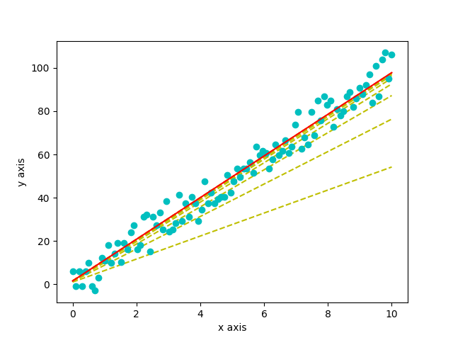

:rootdir: ..
:sourcedir: {rootdir}/../src/basic/linear_regression
include::{rootdir}/adoc/toc.adoc[]

= Linear Regression

== 선형 회귀(Linear Regression)

== Sample Code
=== 샘플 데이터 생성
[source,python]
----
include::{sourcedir}/linear_regression.py[tag=data]
----

=== 가설(Hypothesis)

stem:[h(x) = wx+b]
[source,python]
----
include::{sourcedir}/linear_regression.py[tag=hypothesis]
----

=== 손실 및 손실 함수(Loss & Cost Function)
==== Loss
stem:[
\begin{align}
loss &= y_i - \hat{y_i} \\
&= y_i - h(x) \\
&= y_i - (wx +b) \\
\end{align}
]

==== Cost Function
* 평균 제곱 오차(MSE:Mean Squared Error)

stem:[
\begin{align}
cost = MSE(loss)
&= \frac{1}{n}\sum_{i=1}^{n}loss^2 \\
&= \frac{1}{n}\sum_{i=1}^{n}(y_i - \hat{y_i})^2 \\
&= \frac{1}{n}\sum_{i=1}^{n}(y_i - (wx +b))^2 \\
\end{align}
]

[source,python]
----
include::{sourcedir}/linear_regression.py[tag=cost]
----

=== Optimize
==== 경사하강법(Gradient descent)
선형 최소 제곱(Linear Least Squares) fit

stem:[
\begin{align}
cost_{i+1} &= cost_i - \alpha \nabla f(cost_i) \\
&= cost_i - \alpha (\frac{\partial{f}}{\partial{cost}})
\end{align}
]

==== stem:[\frac {d}{dw} cost]
stem:[
\begin{align}
\frac {\partial}{\partial{w}}(\frac{1}{n}\sum_{i=1}^{n}(y_i - \hat{y_i})^2)
&= \frac {\partial}{\partial{w}}(\frac{1}{n}\sum_{i=1}^{n}(y_i -(wx_i +b))^2) \\
&= \frac {\partial}{\partial{w}}(\frac{1}{n}\sum_{i=1}^{n}(y_i^2 -2y_i(wx_i +b) +(wx_i +b)^2)) \\
&= \frac {\partial}{\partial{w}}(\frac{1}{n}\sum_{i=1}^{n}(y_i^2 -2wx_iy_i -2by_i +w^2x_i^2 +2wbx_i +b^2)) \\
\\
&= \frac{1}{n}\sum_{i=1}^{n}(-2x_iy_i +2wx_i^2 +2bx_i) \\
&= -\frac{2}{n}\sum_{i=1}^{n}x_i(y_i -wx_i -b) \\
&= -\frac{2}{n}\sum_{i=1}^{n}x_i(y_i -(wx_i +b)) \\
&= -\frac{2}{n}\sum_{i=1}^{n}x_i(y_i -\hat{y_i}) \\
\end{align}
]

[source,python]
----
include::{sourcedir}/linear_regression.py[tag=dcost_dw]
----

==== stem:[\frac {d}{db} cost]
stem:[
\begin{align}
\frac {\partial}{\partial{b}}(\frac{1}{n}\sum_{i=1}^{n}(y_i - \hat{y_i})^2)
&= \frac {\partial}{\partial{b}}(\frac{1}{n}\sum_{i=1}^{n}(y_i -(wx_i +b))^2) \\
&= \frac {\partial}{\partial{b}}(\frac{1}{n}\sum_{i=1}^{n}(y_i^2 -2y_i(wx_i +b) +(wx_i +b)^2)) \\
&= \frac {\partial}{\partial{b}}(\frac{1}{n}\sum_{i=1}^{n}(y_i^2 -2wx_iy_i -2by_i +w^2x_i^2 +2wbx_i +b^2)) \\
\\
&= \frac{1}{n}\sum_{i=1}^{n}(-2y_i +2wx_i +2b) \\
&= -\frac{2}{n}\sum_{i=1}^{n}(y_i -wx_i -b) \\
&= -\frac{2}{n}\sum_{i=1}^{n}(y_i -(wx_i +b)) \\
&= -\frac{2}{n}\sum_{i=1}^{n}(y_i -\hat{y_i}) \\
\end{align}
]

[source,python]
----
include::{sourcedir}/linear_regression.py[tag=dcost_db]
----

=== Training
[source,python]
----
include::{sourcedir}/linear_regression.py[tag=hyperparameter]
----
[source,python]
----
include::{sourcedir}/linear_regression.py[tag=train]
----

